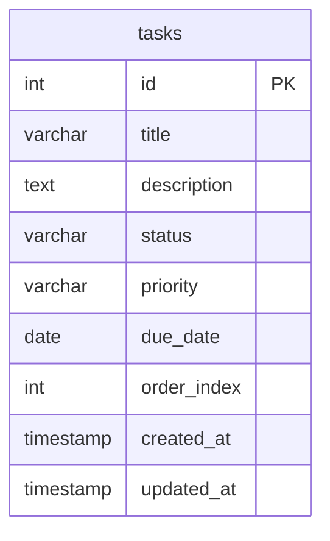

# データベース設計

## エンティティ定義

### tasks テーブル

| カラム名 | 型 | 制約 | 説明 |
|---|---|---|---|
| id | INTEGER | PK, AUTO INCREMENT | 一意識別子 |
| title | VARCHAR(255) | NOT NULL | タスクのタイトル |
| description | TEXT | NULL可 | タスクの詳細説明 |
| status | VARCHAR(20) | NOT NULL, DEFAULT 'todo' | `todo` / `in_progress` / `done` |
| priority | VARCHAR(10) | NULL可 | `high` / `medium` / `low` |
| due_date | DATE | NULL可 | 期限日 |
| order_index | INTEGER | NOT NULL | カラム内の表示順（昇順） |
| created_at | TIMESTAMP | NOT NULL, DEFAULT NOW() | 作成日時 |
| updated_at | TIMESTAMP | NOT NULL, DEFAULT NOW() | 更新日時 |

---

## ER図

