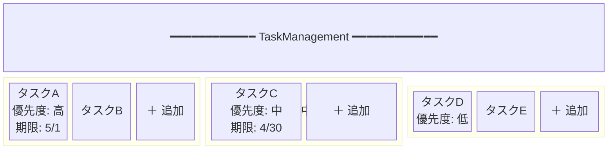
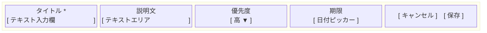
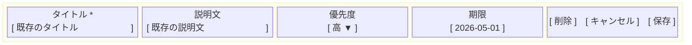
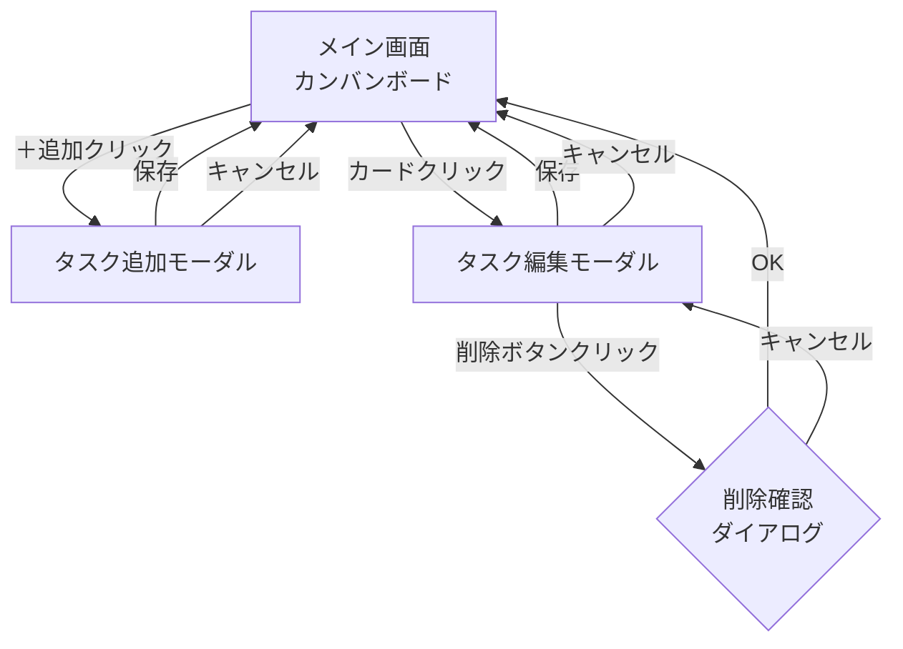
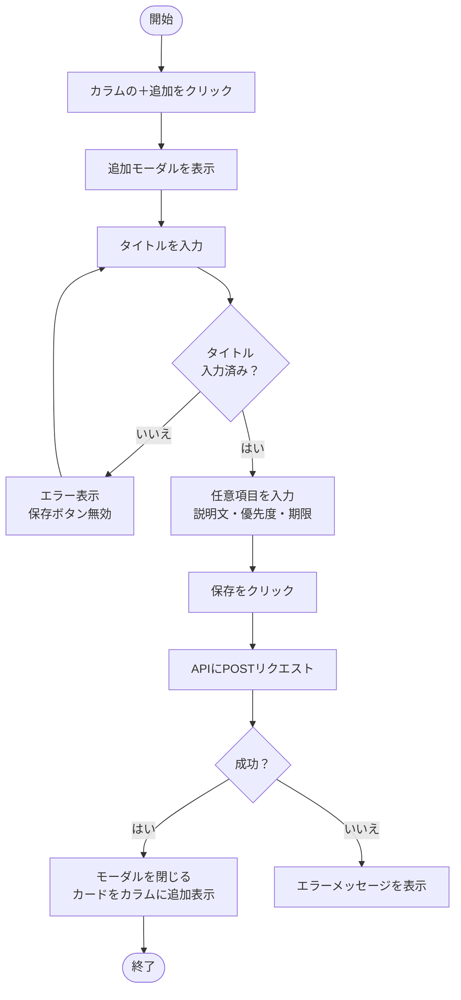
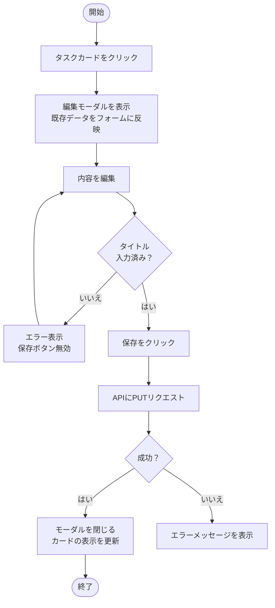
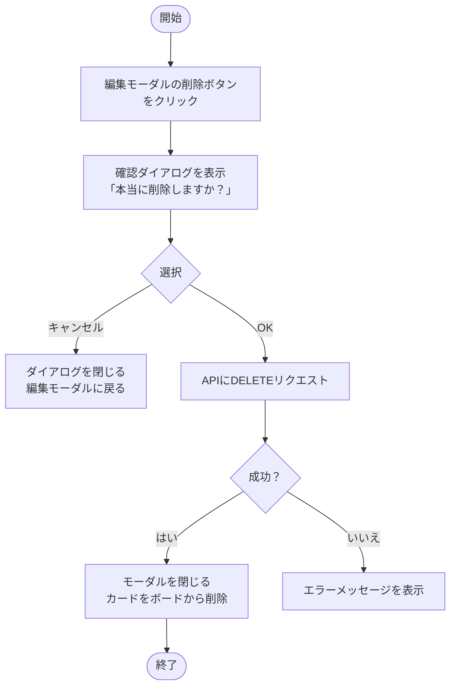
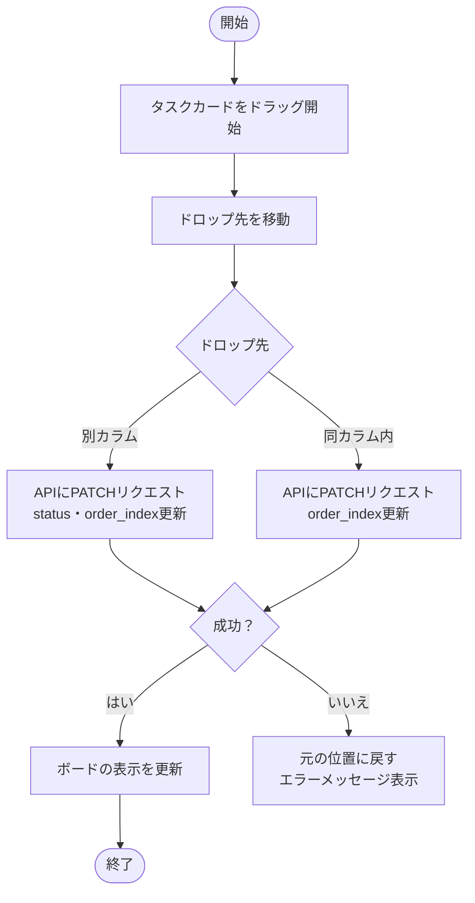
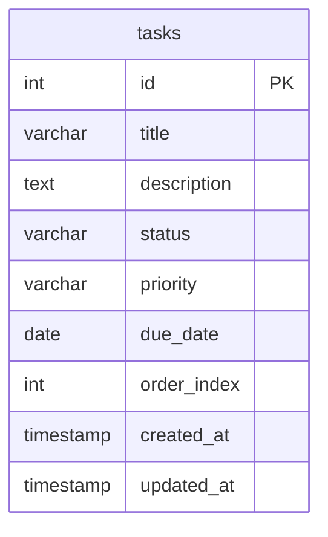

# 要件定義書

## プロジェクト概要

| 項目 | 内容 |
|------|------|
| プロジェクト名 | TaskManagement |
| 概要 | Trello風のカンバンボード型タスク管理Webアプリ |
| 対象ユーザー | 個人利用（シングルユーザー・認証なし） |
| 画面構成 | 1画面（モーダルダイアログあり） |
| 作成日 | 2026-04-24 |
| 更新日 | 2026-04-26 |

---

## 背景・目的

本プロジェクトはスクールの課題として作成するWebアプリケーションである。

**学習目的：**
- フロントエンドのUI実装・インタラクション開発の実践
- バックエンドAPIの設計・実装スキルの習得
- データベース設計（ER図・SQL）の実践
- フロントエンド〜バックエンド〜DBを通じたフルスタック開発の経験

---

## 制約事項

| 項目 | 内容 |
|------|------|
| システム構成 | フロントエンド + バックエンドAPI + DB の3層構成 |
| ユーザー数 | シングルユーザー（マルチユーザー対応なし） |
| 認証 | なし（ログイン機能不要） |
| 動作環境 | ローカル開発環境 |
| 対応デバイス | デスクトップのみ（スマートフォン対応なし） |
| ブラウザ | Chrome / Safari / Firefox 最新版 |

---

## 機能要件

### 1. カンバンボード

- カラムは **未着手 / 進行中 / 完了** の3列固定で表示する
- 各カラムのタスク件数を表示する

### 2. タスクカード

各カードは以下の項目を持つ。

| 項目 | 必須 | 内容 |
|------|------|------|
| タイトル | ○ | タスクの名称 |
| 説明文 | - | タスクの詳細説明 |
| 優先度 | - | 高 / 中 / 低 の3段階 |
| 期限 | - | 日付で指定 |

### 3. タスク操作

| 操作 | 内容 |
|------|------|
| 追加 | 各カラムの「＋追加」ボタンからモーダルを開いて新規追加 |
| 編集 | タスクカードをクリックして編集モーダルを開く |
| 削除 | 編集モーダル内の削除ボタンから削除（確認ダイアログあり） |
| カラム間移動 | ドラッグ&ドロップで別カラムに移動できる |
| カラム内並び替え | ドラッグ&ドロップでカラム内の順序を変更できる |

### 4. バリデーション

- タイトルは必須入力。未入力の場合は保存できない。

---

## 非機能要件

### パフォーマンス

| 項目 | 内容 |
|------|------|
| 想定タスク件数 | 最大100件程度 |
| 操作レスポンス | ボタン操作・保存後の反映は1秒以内 |
| APIレスポンス | 通常のCRUD操作は500ms以内 |

### セキュリティ

| 項目 | 内容 |
|------|------|
| 認証 | なし（個人利用・ローカル環境のため） |
| 入力値検証 | フロントエンド・バックエンド双方でバリデーション実施 |
| SQLインジェクション対策 | ORMまたはプレースホルダーを使用 |
| XSS対策 | ユーザー入力値をそのままHTMLに出力しない |

### 可用性・保守性

| 項目 | 内容 |
|------|------|
| 動作環境 | ローカル開発環境 |
| データ保存 | サーバーサイドDB（永続化） |
| エラー表示 | API失敗時はユーザーにエラーメッセージを表示 |

### アクセシビリティ

| 項目 | 内容 |
|------|------|
| キーボード操作 | フォーム入力・ボタン操作はキーボードで完結できる |
| セマンティックHTML | 適切なHTML要素を使用する |

---

## 画面設計

### ワイヤーフレーム

#### メイン画面（カンバンボード）

#### タスク追加モーダル

#### タスク編集モーダル

### 画面遷移図

---

## ユースケース / 操作フロー

### タスク追加

### タスク編集

### タスク削除

### ドラッグ&ドロップ（カラム間移動・並び替え）

---

## データ設計

### エンティティ定義

#### tasks テーブル

| カラム名 | 型 | 制約 | 説明 |
|---|---|---|---|
| id | INTEGER | PK, AUTO INCREMENT | 一意識別子 |
| title | VARCHAR(255) | NOT NULL | タスクのタイトル |
| description | TEXT | NULL可 | タスクの詳細説明 |
| status | VARCHAR(20) | NOT NULL, DEFAULT 'todo' | `todo` / `in_progress` / `done` |
| priority | VARCHAR(10) | NULL可 | `high` / `mid` / `low` |
| due_date | DATE | NULL可 | 期限日 |
| order_index | INTEGER | NOT NULL | カラム内の表示順（昇順） |
| created_at | TIMESTAMP | NOT NULL, DEFAULT NOW() | 作成日時 |
| updated_at | TIMESTAMP | NOT NULL, DEFAULT NOW() | 更新日時 |

### ER図

---

## 技術選定

> ※ 技術スタックは別途決定予定。

| レイヤー | 技術 | 備考 |
|---|---|---|
| フロントエンド | TBD | React / Vue.js など |
| バックエンド | TBD | Node.js+Express / Ruby on Rails など |
| データベース | TBD | PostgreSQL / MySQL / SQLite など |
| ORM | TBD | Prisma / Sequelize / ActiveRecord など |
| 実行環境 | ローカル開発環境 | |

---

## スコープ外（将来的に追加を検討する機能）

- タスクの検索・フィルター
- 優先度・期限によるソート
- カラムのカスタマイズ（追加・削除・名称変更）
- タグ・ラベル機能
- ダークモード
- マルチユーザー対応・認証機能
