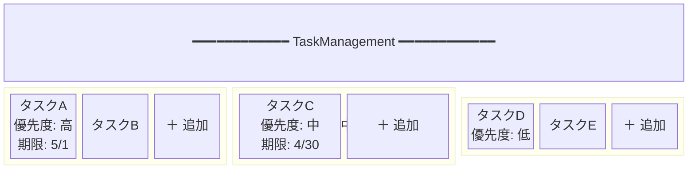
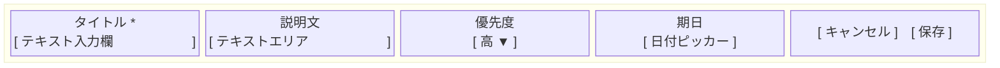
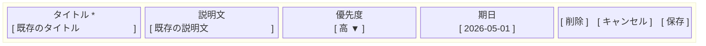
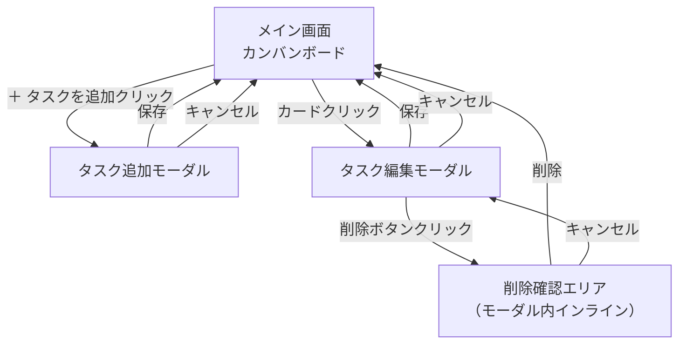

# 画面設計

## 画面一覧

| 画面名 | 種別 | 説明 |
|---|---|---|
| メイン画面（カンバンボード） | 通常画面 | アプリの唯一の画面。全タスクをカラム別に表示する |
| タスク追加モーダル | モーダル | 新規タスクを作成するフォーム |
| タスク編集モーダル | モーダル | 既存タスクを編集・削除するフォーム |
| 削除確認エリア | インライン | タスク編集モーダル内に展開する削除前の確認エリア |

---

## 画面要件

### メイン画面（カンバンボード）

**表示要件**

| 要素 | 要件 |
|---|---|
| ヘッダー | アプリ名「TaskManagement」を表示する |
| カラム | 未着手 / 進行中 / 完了 の3列を横並びで表示する |
| カラムヘッダー | カラム名・タスク件数・「優先度」「期限」ソートボタンを表示する |
| タスクカード | タイトルを必ず表示する。優先度・期限はセットされている場合のみ表示する。ホバー時にゴミ箱ボタンとステータスアクションボタンを表示する |
| 追加ボタン | 各カラムの末尾に「＋ タスクを追加」ボタンを表示する |

**インタラクション要件**

| 操作 | 挙動 |
|---|---|
| カードクリック | タスク編集モーダルを開く |
| タイトルのダブルクリック | タイトルをインライン編集モードに切り替える。Enter またはフォーカス外れで保存、Escape でキャンセル |
| ステータスアクションボタンクリック | ステータスを1段階進める（未着手→「▶ 開始する」、進行中→「✓ 完了にする」、完了→「↩ 戻す」） |
| ゴミ箱ボタンクリック | 確認ダイアログなしでタスクを即時削除する |
| ＋ タスクを追加クリック | タスク追加モーダルを開く（クリックしたカラムが初期ステータスになる） |
| カードドラッグ&ドロップ（カラム内） | カラム内でカードを任意の位置へ手動で並び替えできる |
| カードドラッグ&ドロップ（カラム間） | 別カラムへ移動できる。移動先ではドロップした位置に挿入される |
| ドラッグ中 | ドラッグ中のカードは視覚的にフィードバック（半透明・影など）を与える |
| ドロップ先 | 挿入位置をハイライトで示す |
| 優先度 / 期限ソートボタンクリック | そのカラム内のタスクを選択した項目でソートする。同じボタンを再クリックすると昇順 / 降順がトグルする |

---

### タスク追加モーダル

**表示要件**

| 要素 | 必須 | 要件 |
|---|---|---|
| モーダルタイトル | ○ | 「タスクを追加」と表示する |
| タイトル入力欄 | ○ | テキスト入力。必須項目であることをラベルで示す（例：`*`） |
| 説明文入力欄 | - | テキストエリア |
| 優先度セレクト | - | 高 / 中 / 低 から選択。未選択状態（空白）を初期値とする |
| 期日ピッカー | - | 日付選択。未選択状態を初期値とする |
| キャンセルボタン | ○ | モーダルを閉じる |
| 保存ボタン | ○ | タスクを保存する |

**インタラクション要件**

| 条件 | 挙動 |
|---|---|
| タイトル未入力 | 保存ボタンを非活性にする、またはエラーメッセージを表示する |
| 保存成功 | モーダルを閉じ、対象カラムにカードを追加表示する |
| 保存失敗 | モーダルを閉じずエラーメッセージを表示する |
| キャンセル | モーダルを閉じる（入力内容は破棄） |

---

### タスク編集モーダル

**表示要件**

| 要素 | 必須 | 要件 |
|---|---|---|
| モーダルタイトル | ○ | 「タスクを編集」と表示する |
| タイトル入力欄 | ○ | 既存のタイトルを初期値として表示する |
| 説明文入力欄 | - | 既存の説明文を初期値として表示する |
| 優先度セレクト | - | 既存の優先度を初期値として表示する |
| 期日ピッカー | - | 既存の期日を初期値として表示する |
| 削除ボタン | ○ | 削除確認ダイアログを開く |
| キャンセルボタン | ○ | モーダルを閉じる |
| 保存ボタン | ○ | 変更内容を保存する |

**インタラクション要件**

| 条件 | 挙動 |
|---|---|
| タイトル未入力 | 保存ボタンを非活性にする、またはエラーメッセージを表示する |
| 保存成功 | モーダルを閉じ、カードの表示内容を更新する |
| 保存失敗 | モーダルを閉じずエラーメッセージを表示する |
| キャンセル | モーダルを閉じる（変更内容は破棄） |
| 削除ボタンクリック | 削除確認ダイアログを表示する |

---

### 削除確認エリア（編集モーダル内インライン）

削除確認は独立したダイアログではなく、タスク編集モーダル内に展開するインラインエリアとして実装される。

**表示要件**

| 要素 | 要件 |
|---|---|
| メッセージ | 「本当に削除しますか？」と表示する |
| 削除ボタン | 削除を実行する |
| キャンセルボタン | 確認エリアを閉じて編集モーダルの通常表示に戻る |

**インタラクション要件**

| 条件 | 挙動 |
|---|---|
| 削除選択・削除成功 | モーダルを閉じ、カードをボードから削除する |
| 削除選択・削除失敗 | エラーメッセージを表示する |
| キャンセル選択 | 確認エリアを閉じて編集モーダルの通常表示に戻る |

---

## ワイヤーフレーム

### メイン画面（カンバンボード）

### タスク追加モーダル

### タスク編集モーダル

---

## 画面遷移図

