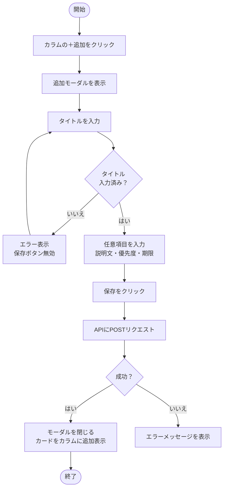
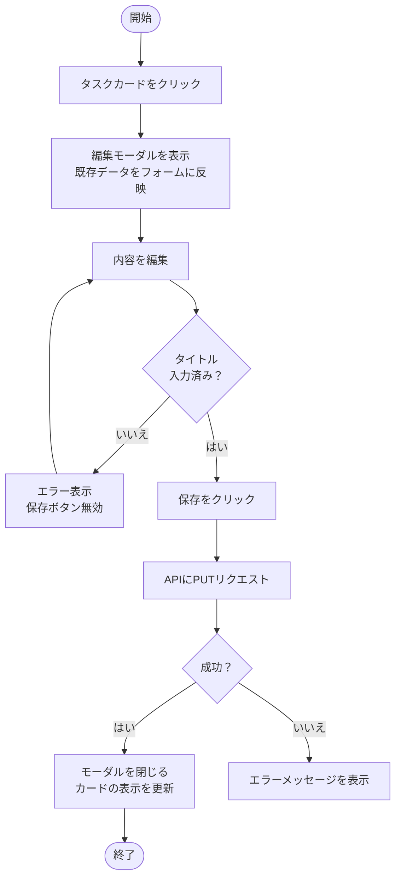
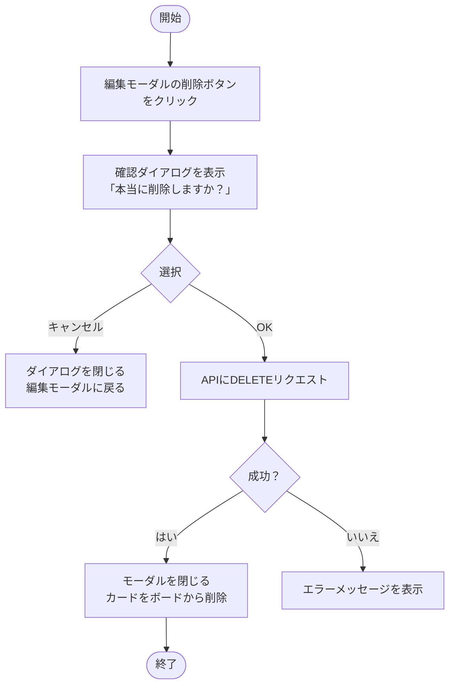
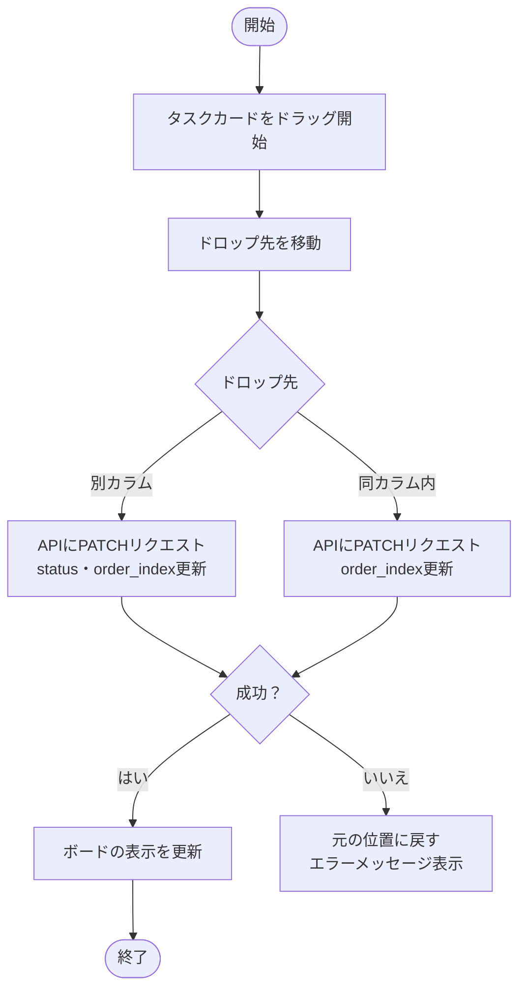

# ユースケース / 操作フロー

## タスク追加

```mermaid
flowchart TD
  S([開始]) --> A[カラムの＋追加をクリック]
  A --> B[追加モーダルを表示]
  B --> C[タイトルを入力]
  C --> D{タイトル\n入力済み？}
  D -- いいえ --> E[エラー表示\n保存ボタン無効]
  E --> C
  D -- はい --> F[任意項目を入力\n説明文・優先度・期限]
  F --> G[保存をクリック]
  G --> H[APIにPOSTリクエスト]
  H --> I{成功？}
  I -- はい --> J[モーダルを閉じる\nカードをカラムに追加表示]
  I -- いいえ --> K[エラーメッセージを表示]
  J --> Z([終了])
```

## タスク編集

```mermaid
flowchart TD
  S([開始]) --> A[タスクカードをクリック]
  A --> B[編集モーダルを表示\n既存データをフォームに反映]
  B --> C[内容を編集]
  C --> D{タイトル\n入力済み？}
  D -- いいえ --> E[エラー表示\n保存ボタン無効]
  E --> C
  D -- はい --> F[保存をクリック]
  F --> G[APIにPUTリクエスト]
  G --> H{成功？}
  H -- はい --> I[モーダルを閉じる\nカードの表示を更新]
  H -- いいえ --> J[エラーメッセージを表示]
  I --> Z([終了])
```

## タスク削除

```mermaid
flowchart TD
  S([開始]) --> A[編集モーダルの削除ボタンをクリック]
  A --> B[確認ダイアログを表示\n「本当に削除しますか？」]
  B --> C{選択}
  C -- キャンセル --> D[ダイアログを閉じる\n編集モーダルに戻る]
  C -- OK --> E[APIにDELETEリクエスト]
  E --> F{成功？}
  F -- はい --> G[モーダルを閉じる\nカードをボードから削除]
  F -- いいえ --> H[エラーメッセージを表示]
  G --> Z([終了])
```

## ドラッグ&ドロップ（カラム間移動・並び替え）

```mermaid
flowchart TD
  S([開始]) --> A[タスクカードをドラッグ開始]
  A --> B[ドロップ先を移動]
  B --> C{ドロップ先}
  C -- 別カラム --> D[APIにPATCHリクエスト\nstatus・order_index更新]
  C -- 同カラム内 --> E[APIにPATCHリクエスト\norder_index更新]
  D --> F{成功？}
  E --> F
  F -- はい --> G[ボードの表示を更新]
  F -- いいえ --> H[元の位置に戻す\nエラーメッセージ表示]
  G --> Z([終了])
```
